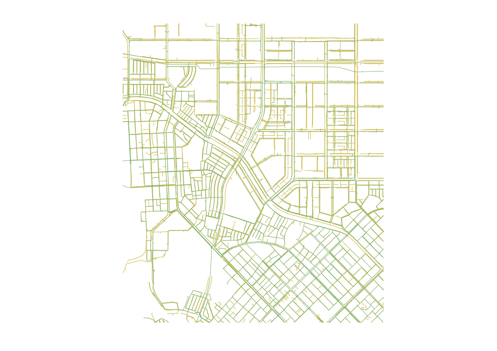
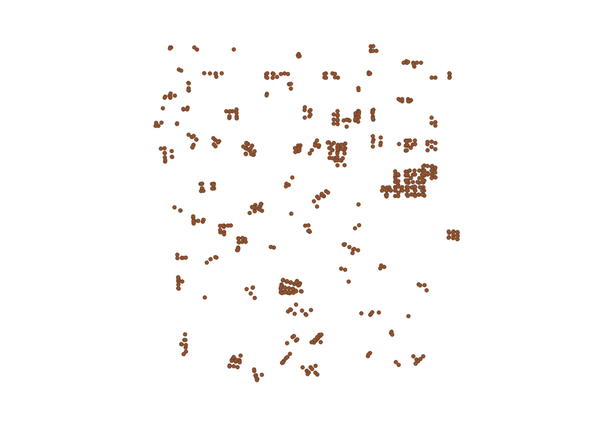
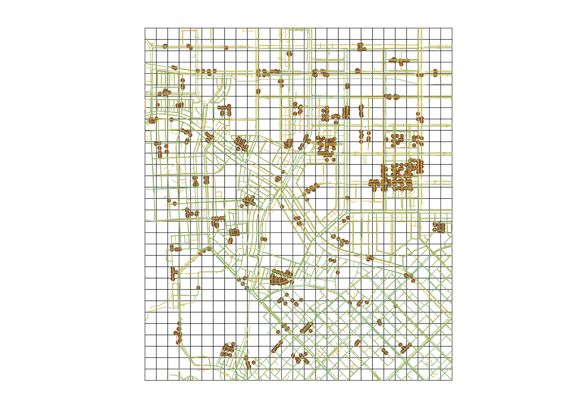
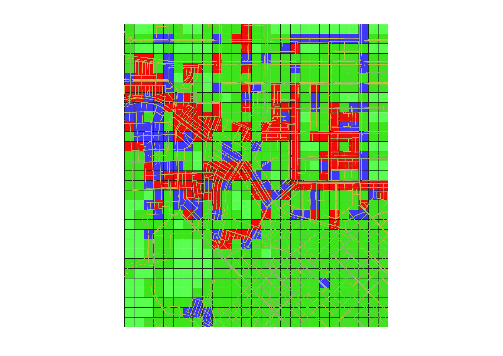

# AI 기반 지반함몰 위험도 예측 실습 지침서

## 실습에서 해결할 문제

이번 실습의 핵심은 서로 다른 형태의 공간정보를 **동일한 분석 단위인 그리드**에 결합하는 것입니다. 매설관의 위치와 특성, 발견된 지하공동의 위치를 그리드별 데이터로 집계하면 각 칸마다 관로 밀집도, 시공 시기별 관로 길이, 공동 개수 등의 입력 변수를 만들 수 있습니다. AI 모델은 이 결합 데이터를 학습하여 각 그리드의 지반함몰 위험도를 Low, Medium, High로 예측합니다.

<table>
  <tr>
    <td align="center" width="33%">
      <br>
      <strong>① 매설관 정보</strong><br>
      상·하수도관의 위치와 시공 시기
    </td>
    <td align="center" width="33%">
      <br>
      <strong>② 공동 정보</strong><br>
      발견된 지하공동의 위치
    </td>
    <td align="center" width="33%">
      <br>
      <strong>③ 분석 그리드</strong><br>
      모델이 예측할 공간 단위
    </td>
  </tr>
  <tr>
    <td colspan="3" align="center"><strong>↓ 공간정보 결합 및 그리드별 변수 집계 ↓</strong></td>
  </tr>
  <tr>
    <td colspan="3" align="center">
      <br>
      <strong>④ 결합 데이터</strong><br>
      각 그리드에 매설관과 공동 정보를 연결하여 AI가 학습할 표 형태의 데이터를 생성
    </td>
  </tr>
  <tr>
    <td colspan="3" align="center"><strong>↓ AI 분류 모델 학습 및 예측 ↓</strong></td>
  </tr>
  <tr>
    <td colspan="3" align="center">
      <br>
      <strong>⑤ 지반함몰 위험도 예측</strong><br>
      각 그리드를 Low, Medium, High의 세 위험등급으로 분류
    </td>
  </tr>
</table>

> 즉, 이 실습의 Excel 데이터에서 **한 행은 하나의 그리드**를 의미합니다. 각 열은 해당 그리드 안에 포함된 매설관과 공동 정보를 수치화한 것이고, `risk`는 모델이 예측해야 할 위험등급입니다.

## 1. 실습 목표

이번 실습에서는 도시 인프라 데이터를 이용하여 공간 단위의 지반함몰 위험도를 예측합니다.

실습을 통해 아래 사항들을 설명할 수 있습니다. 

- 건설환경공학 데이터를 분류 문제로 정의하는 방법
- 관로 밀집도, 시공 시기별 관로 길이, 공동 개수의 의미
- 기본 변수와 전체 원본 변수, 파생 변수의 차이
- Accuracy, F1-score, Confusion Matrix의 해석 방법
- 모델의 변수 중요도를 지반함몰 관점에서 해석하는 방법

## 2. 난이도 선택

세 과정은 동일한 데이터와 분석 목표를 사용합니다. 차이는 제공되는 코드와 힌트의 양입니다.

| 과정 | 제공 수준 | 주요 활동 |
|---|---|---|
| Beginner | 코드 대부분 제공 | 셀 실행, 결과 관찰, 해석 질문 답변 |
| Intermediate | 코드 골격과 일부 빈칸 제공 | 변수 선택, 함수 인수와 핵심 코드 완성 |
| Advanced | 목표·조건·짧은 힌트 제공 | 분석 과정 직접 설계 및 구현 |

 학습 속도와 경험에 따라 다른 난이도로 이동하는 방식을 권장합니다. 세 노트북을 모두 수행할 필요는 없습니다.

- [Beginner 노트북 — Colab에서 실행](https://colab.research.google.com/github/GeoSeonghoHong/Seongho-Hong/blob/main/notebooks/beginner.ipynb)
- [Intermediate 노트북 — Colab에서 실행](https://colab.research.google.com/github/GeoSeonghoHong/Seongho-Hong/blob/main/notebooks/intermediate.ipynb)
- [Advanced 노트북 — Colab에서 실행](https://colab.research.google.com/github/GeoSeonghoHong/Seongho-Hong/blob/main/notebooks/advanced.ipynb)
- [Solution 노트북 — Colab에서 실행](https://colab.research.google.com/github/GeoSeonghoHong/Seongho-Hong/blob/main/notebooks/solution.ipynb)

## 3. 60분 실습 구성

| 구간 | 내용 | 권장 시간 |
|---|---|---:|
| 1 | 환경 확인과 데이터 불러오기 | 5분 |
| 2 | 데이터 구조와 위험도 분포 확인 | 10분 |
| 3 | Model A: 밀집도 변수 2개 | 10분 |
| 4 | Model B: 원본 변수 전체 | 10분 |
| 5 | Model C: 원본 변수와 파생 변수 | 10분 |
| 6 | 세 모델의 성능 비교 | 10분 |
| 7 | 변수 중요도와 도메인 해석 | 5분 |

## 4. 데이터 파일

- 파일: `data/hannam_sinkhole_data.xlsx`
- 시트: `training_data`
- 각 행: 하나의 공간 단위
- 목표 변수: `risk`

| risk | 의미 |
|---:|---|
| 0 | Low, 저위험 |
| 1 | Medium, 중위험 |
| 2 | High, 고위험 |

## 5. 주요 변수

| 구분 | 컬럼 | 설명 |
|---|---|---|
| 식별자 | `id` | 공간 단위 식별자 |
| 상수도관 | `water_Y_5` ~ `water_Y_55` | 시공 시기 구간별 상수도관 길이 |
| 상수도관 밀집도 | `water_Density` | 해당 공간의 상수도관 밀집도 |
| 하수도관 | `sewer_Y_5` ~ `sewer_Y_20` | 시공 시기 구간별 하수도관 길이 |
| 하수도관 밀집도 | `sewer_Density` | 해당 공간의 하수도관 밀집도 |
| 공동 | `cavity_count` | 발견된 지하공동 개수 |
| 위험도 | `risk` | 예측할 위험도 등급 |

## 6. 코드에서 사용하는 변수 묶음

코드에 등장하는 `water_features`, `raw_features` 등의 이름은 Excel의 개별 컬럼이 아닙니다. **모델에 전달할 여러 컬럼명을 목적에 따라 묶어 놓은 Python 리스트**입니다.

| Python 변수명 | 의미 | 포함되는 Excel 컬럼 |
|---|---|---|
| `water_features` | 시공 시기별 상수도관 길이 변수 묶음 | `water_Y_5` ~ `water_Y_55` |
| `sewer_features` | 시공 시기별 하수도관 길이 변수 묶음 | `sewer_Y_5` ~ `sewer_Y_20` |
| `basic_features` | 관로 밀집도만 사용하는 기준 변수 묶음 | `water_Density`, `sewer_Density` |
| `raw_features` | 원본 데이터에서 바로 사용하는 관로·공동 변수 묶음 | `water_features`, `water_Density`, `sewer_features`, `sewer_Density`, `cavity_count` |
| `derived_features` | 원본 변수를 조합하여 만든 파생 변수 묶음 | `total_water_length`, `total_sewer_length`, `pipe_total_density`, `water_sewer_ratio`, `old_pipe_ratio`, `recent_pipe_ratio`, `cavity_density_interaction` |
| `engineered_features` | 원본 변수와 파생 변수를 모두 포함한 변수 묶음 | `raw_features + derived_features` |

코드에서는 다음과 같은 관계로 정의합니다.

```python
water_features = [f"water_Y_{year}" for year in range(5, 60, 5)]
sewer_features = [f"sewer_Y_{year}" for year in range(5, 25, 5)]

basic_features = [
    "water_Density",
    "sewer_Density",
]

raw_features = (
    water_features
    + ["water_Density"]
    + sewer_features
    + ["sewer_Density", "cavity_count"]
)

engineered_features = raw_features + derived_features
```

> 예를 들어 `raw_features`라는 컬럼이 Excel에 존재하는 것이 아닙니다. `raw_features`는 Model B에 한 번에 전달할 여러 Excel 컬럼명을 저장한 Python 변수입니다.

### 모델별 변수 구성

| 모델 | 사용하는 Python 변수 | 확인하려는 내용 |
|---|---|---|
| Model A | `basic_features` | 관로 밀집도만으로 위험도를 구분할 수 있는가? |
| Model B | `raw_features` | 시공 시기별 관로 길이와 공동 정보가 추가되면 성능이 달라지는가? |
| Model C | `engineered_features` | 도메인 지식을 반영한 파생 변수가 추가되면 성능이 달라지는가? |

## 7. 파생 변수

| 컬럼 | 의미 |
|---|---|
| `total_water_length` | 상수도관 전체 길이 |
| `total_sewer_length` | 하수도관 전체 길이 |
| `pipe_total_density` | 상수도관 밀집도와 하수도관 밀집도의 합 |
| `water_sewer_ratio` | 상수도관 밀집도와 하수도관 밀집도의 비율 |
| `old_pipe_ratio` | 전체 관로 중 노후 관로 비율 |
| `recent_pipe_ratio` | 전체 관로 중 최근 관로 비율 |
| `cavity_density_interaction` | 공동 개수와 전체 관로 밀집도의 상호작용 |

## 8. 실습 진행 순서

### Step 1. 데이터 확인

데이터의 크기, 컬럼, 결측치와 위험도 등급별 개수를 확인합니다.

생각해 볼 질문:

- 위험도 등급별 데이터 수가 균등한가요?
- 식별자 `id`를 입력 변수로 사용하면 안 되는 이유는 무엇인가요?

### Step 2. Model A — 밀집도 변수 2개

다음 두 개의 변수만 사용해 기준 모델을 만듭니다.

- `water_Density`
- `sewer_Density`

생각해 볼 질문:

- 두 개의 밀집도만으로 세 위험등급을 충분히 구분할 수 있나요?
- 어떤 위험등급에서 오분류가 많이 발생하나요?

### Step 3. Model B — 원본 변수 전체

시공 시기별 상·하수도관 길이, 밀집도, 공동 개수를 함께 사용합니다.

생각해 볼 질문:

- 입력 변수를 늘리자 성능이 좋아졌나요?
- 공동 개수가 추가되면 어떤 위험등급의 예측이 달라지나요?

### Step 4. Model C — 파생 변수 포함

원본 변수에 관로 총길이, 노후도, 밀집도와 공동의 상호작용 변수를 추가합니다.

생각해 볼 질문:

- 도메인 지식을 반영한 파생 변수가 성능 향상에 도움이 되었나요?
- 성능이 좋아졌다면 어떤 정보가 새롭게 표현되었기 때문인가요?

### Step 5. 모델 비교와 해석

세 모델의 Accuracy와 Macro F1-score를 비교합니다. Confusion Matrix에서는 특히 High 등급을 다른 등급으로 잘못 예측한 사례를 확인합니다.

### Step 6. 변수 중요도

Model C의 변수 중요도를 확인하고 다음 질문을 논의합니다.

- 공동 개수와 관로 밀집도가 함께 높은 지역은 왜 위험할 수 있나요?
- 노후 관로 비율이 높으면 지반함몰 가능성이 커질 수 있나요?
- 변수 중요도가 높다는 것이 곧 원인과 결과를 의미하나요?

## 9. 최종 정리

다음 내용을 3~5문장으로 정리합니다.

1. 가장 높은 성능을 보인 모델
2. 모델별 Accuracy와 Macro F1-score
3. 가장 중요하게 나타난 변수
4. 결과에 대한 지반공학적 해석
5. 모델 결과를 실제 위험지도에 사용할 때 주의할 점
